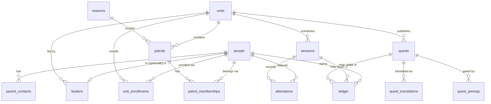

Task 02. Migrations: `supabase/migrations/20260909120000_wave1_schema.sql` (schema)
and `20260909120100_wave1_rls.sql` (RLS). pgTAP suite: `supabase/tests/*.sql`.

## ERD

Not shown: `audit_log`, standalone (references any table via `subject_table` +
`subject_id`, no FK — it has to be able to point at a row after that row's own
FKs might not apply, e.g. a deleted-then-purged person).

## Deliberate gaps and open questions (not resolved by this task)

- **`seasons` isn't in `docs/tasks/02-schema-rls.md`'s table list**, but
  `patrols.season_id` references one. D2 (season model / rollover — see
  `docs/open-decisions.md`) is unresolved. Added a minimal `seasons (id, name,
started_at, ended_at)` table only to satisfy the FK — no rollover semantics
  implemented or implied. Revisit once D2 is decided.
- **`ledger.delta` allows exactly `0` for `reason = 'attendance'`** (CHECK
  constraint), and requires `abs(delta) in (10,25,50,100)` for
  `'award'`/`'correction'`. D6 (is attendance itself a quest that awards
  points, or a separate zero-point mechanic?) is unresolved — this schema
  stays agnostic: an attendance-only ledger row carries no points today. If
  D6 resolves to "attendance awards points," that's a separate `'award'`-reason
  row tied to a quest, not a change to this constraint.
- **`parent_contacts` "audit row on every read" (docs/spec.md, non-negotiable)
  is NOT implemented here.** Postgres has no `SELECT` trigger, so a raw
  table-level RLS policy — what's built and pgTAP-tested in this task — cannot
  itself log reads. Real audit-on-read requires routing reads through a
  `SECURITY DEFINER` function that logs then returns rows. Out of scope for
  schema+RLS; must land before Wave 1 ships real parent data.
- **Leaders get read-only access to `parent_contacts`, no write.** The task
  file's RLS bullets only mention leader _read_; write is admin-only here as a
  least-privilege default. Flag if leaders are expected to maintain their own
  scouts' contacts directly.
- **Patrol-mate "point totals" (docs/tasks/02-schema-rls.md RLS bullets)
  aren't exposed by this task.** Raw ledger rows are never given to
  patrol-mates (too much per-row detail — reason, quest, timestamp). A
  `patrol_standings`-style aggregate view/function belongs to whichever task
  builds the standings screen (likely Task 09).

## RLS policy intent, one line each

Every table is `ENABLE ROW LEVEL SECURITY` with no permissive default —
absence of a matching policy is a hard deny. Role checks (`is_admin()`,
`is_leader_of_unit()`, `is_enrolled_in_unit()`, `shares_active_patrol()`) are
all derived live from `leaders` / `unit_enrollments` / `patrol_memberships` on
every call — never trusted from a JWT claim, so a demoted leader or an ended
enrollment loses access immediately, not at next token refresh.

| Table                | Policy intent                                                                                                                                                                                      |
| -------------------- | -------------------------------------------------------------------------------------------------------------------------------------------------------------------------------------------------- |
| `people`             | Own row, patrol-mates, or same-unit staff can read; admin writes.                                                                                                                                  |
| `parent_contacts`    | Same-unit leader or admin can read; nobody else, ever; admin-only write.                                                                                                                           |
| `units`              | Visible only to admin, the unit's leader, or an actively-enrolled scout.                                                                                                                           |
| `unit_enrollments`   | Own rows, admin, or the unit's leader can read; admin writes.                                                                                                                                      |
| `seasons`            | Readable by any signed-in user (not sensitive); admin writes.                                                                                                                                      |
| `patrols`            | Same-unit staff/scout can read; admin or that unit's leader writes.                                                                                                                                |
| `patrol_memberships` | Own rows, patrol-mates, admin, or the patrol's unit leader can read; admin or that leader writes.                                                                                                  |
| `leaders`            | A leader sees only their own row; admin sees all; admin-only write — scouts never see this table.                                                                                                  |
| `sessions`           | Same-unit staff/scout can read; admin or that unit's leader writes.                                                                                                                                |
| `quests`             | Scouts see only published, non-expired, own-unit quests; staff see everything in their unit; writes are unit-scoped (any leader in that unit, not creator-only).                                   |
| `quest_translations` | Mirrors the parent quest's visibility and write rules.                                                                                                                                             |
| `quest_prereqs`      | Mirrors the gated quest's (`quest_id`) visibility and write rules.                                                                                                                                 |
| `ledger`             | Own rows, admin, or the person's unit leader can read; append-only — INSERT/UPDATE/DELETE revoked from every role, admin included. Task 04's `SECURITY DEFINER` functions are the only write path. |
| `attendance`         | Own rows, admin, or the session's unit leader can read; staff write freely in their unit; a scout may INSERT only their own row with `status = 'excused'`.                                         |
| `audit_log`          | Admin-only read; INSERT/UPDATE/DELETE revoked from every role — genuinely append-only, no exceptions, ever.                                                                                        |

## pgTAP suite

`supabase/tests/001_scout_access.sql` through `005_enrollment_expiry.sql`,
sharing fixtures from `supabase/tests/support/fixtures.sql` (included via
`\ir`, one `begin;...rollback;` per file so nothing persists). 34 assertions
total, covering every case in `docs/tasks/02-schema-rls.md`'s checklist:

- scout: cross-unit `people`/`parent_contacts`/quest denial, `audit_log`
  denial, own-ledger-only, plus a few positive checks (own row, patrol-mate,
  own-unit published quest) so a policy that denies everything wouldn't
  silently "pass."
- leader: cross-unit `people`/`parent_contacts` denial, direct ledger INSERT
  denial, cross-unit quest UPDATE denial (and a same-unit UPDATE positive
  check).
- admin: cross-unit read confirmed on `people` and `parent_contacts`.
- anon: RLS-filtered to zero rows on a granted table (`people`), and a hard
  permission error on tables anon has no grant on at all (`ledger`,
  `leaders`, `parent_contacts`) — both are valid shapes of "reads nothing."
- ledger + audit_log: admin cannot INSERT/UPDATE/DELETE directly either —
  nobody has a write path except a future `SECURITY DEFINER` function.
- enrollment expiry: a scout with only a past (`ended_at`) enrollment loses
  `units`/`quests`/`sessions` access for that unit, while keeping their own
  `people` row.

"Policies survive `supabase db reset`, suite runs green from scratch" isn't a
SQL assertion — it's a property of `scripts/db-reset.sh` itself (drop,
recreate, migrate, test, always from an empty database). Verified locally by
running `npm run db:reset` three times in a row: 34/34 green each time.

## What this task deliberately does not build

Auth (PIN/TOTP, Task 03), the ledger write functions (Task 04), and the
`SECURITY DEFINER` audit-on-read function for `parent_contacts` (see above,
unassigned). This task is schema + RLS + pgTAP only.
