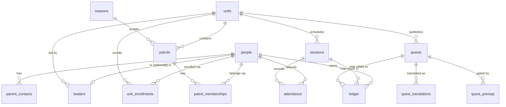

Task 02. Migrations: `supabase/migrations/20260909120000_wave1_schema.sql` (schema)
and `20260909120100_wave1_rls.sql` (RLS). pgTAP suite: `supabase/tests/*.sql`.

## ERD

Not shown: `audit_log`, standalone (references any table via `subject_table` +
`subject_id`, no FK — it has to be able to point at a row after that row's own
FKs might not apply, e.g. a deleted-then-purged person).

## Deliberate gaps and open questions (not resolved by this task)

- **`seasons` isn't in `docs/tasks/02-schema-rls.md`'s table list**, but
  `patrols.season_id` references one. D2 (season model / rollover — see
  `docs/open-decisions.md`) is unresolved. Added a minimal `seasons (id, name,
started_at, ended_at)` table only to satisfy the FK — no rollover semantics
  implemented or implied. Revisit once D2 is decided.
- **`ledger.delta` allows exactly `0` for `reason = 'attendance'`** (CHECK
  constraint), and requires `abs(delta) in (10,25,50,100)` for
  `'award'`/`'correction'`. D6 (is attendance itself a quest that awards
  points, or a separate zero-point mechanic?) is unresolved — this schema
  stays agnostic: an attendance-only ledger row carries no points today. If
  D6 resolves to "attendance awards points," that's a separate `'award'`-reason
  row tied to a quest, not a change to this constraint.
- **`parent_contacts` "audit row on every read" (docs/spec.md, non-negotiable)
  is NOT implemented here.** Postgres has no `SELECT` trigger, so a raw
  table-level RLS policy — what's built and pgTAP-tested in this task — cannot
  itself log reads. Real audit-on-read requires routing reads through a
  `SECURITY DEFINER` function that logs then returns rows. Out of scope for
  schema+RLS; must land before Wave 1 ships real parent data.
- **Leaders get read-only access to `parent_contacts`, no write.** The task
  file's RLS bullets only mention leader _read_; write is admin-only here as a
  least-privilege default. Flag if leaders are expected to maintain their own
  scouts' contacts directly.
- **Patrol-mate "point totals" (docs/tasks/02-schema-rls.md RLS bullets)
  aren't exposed by this task.** Raw ledger rows are never given to
  patrol-mates (too much per-row detail — reason, quest, timestamp). A
  `patrol_standings`-style aggregate view/function belongs to whichever task
  builds the standings screen (likely Task 09).

## RLS policy intent, one line each

Every table is `ENABLE ROW LEVEL SECURITY` with no permissive default —
absence of a matching policy is a hard deny. Role checks (`is_admin()`,
`is_leader_of_unit()`, `is_enrolled_in_unit()`, `shares_active_patrol()`) are
all derived live from `leaders` / `unit_enrollments` / `patrol_memberships` on
every call — never trusted from a JWT claim, so a demoted leader or an ended
enrollment loses access immediately, not at next token refresh.

**Table grants are broad on purpose** (`SELECT`/`INSERT`/`UPDATE`/`DELETE` to
both `anon` and `authenticated` on every table, via `ALTER DEFAULT
PRIVILEGES` too, so it covers future tables). This matches how a real
self-hosted Supabase cluster actually bootstraps — confirmed by running
`supabase start` locally and inspecting `\dp`. An earlier version of this
migration under-granted `anon` on a few tables, hoping for defense-in-depth;
that turned out to be untested against the real target and just diverged
from it — a table with no grant errors on query instead of returning zero
rows, which isn't what production does. RLS is the only real gate here, per
docs/spec.md — `ledger` and `audit_log` are the one deliberate exception,
with an explicit `REVOKE` on top for their non-negotiable "nobody writes
directly" rule.

| Table                | Policy intent                                                                                                                                                                                      |
| -------------------- | -------------------------------------------------------------------------------------------------------------------------------------------------------------------------------------------------- |
| `people`             | Own row, patrol-mates, or same-unit staff can read; admin writes.                                                                                                                                  |
| `parent_contacts`    | Same-unit leader or admin can read; nobody else, ever; admin-only write.                                                                                                                           |
| `units`              | Visible only to admin, the unit's leader, or an actively-enrolled scout.                                                                                                                           |
| `unit_enrollments`   | Own rows, admin, or the unit's leader can read; admin writes.                                                                                                                                      |
| `seasons`            | Readable by any signed-in user (not sensitive); admin writes.                                                                                                                                      |
| `patrols`            | Same-unit staff/scout can read; admin or that unit's leader writes.                                                                                                                                |
| `patrol_memberships` | Own rows, patrol-mates, admin, or the patrol's unit leader can read; admin or that leader writes.                                                                                                  |
| `leaders`            | A leader sees only their own row; admin sees all; admin-only write — scouts never see this table.                                                                                                  |
| `sessions`           | Same-unit staff/scout can read; admin or that unit's leader writes.                                                                                                                                |
| `quests`             | Scouts see only published, non-expired, own-unit quests; staff see everything in their unit; writes are unit-scoped (any leader in that unit, not creator-only).                                   |
| `quest_translations` | Mirrors the parent quest's visibility and write rules.                                                                                                                                             |
| `quest_prereqs`      | Mirrors the gated quest's (`quest_id`) visibility and write rules.                                                                                                                                 |
| `ledger`             | Own rows, admin, or the person's unit leader can read; append-only — INSERT/UPDATE/DELETE revoked from every role, admin included. Task 04's `SECURITY DEFINER` functions are the only write path. |
| `attendance`         | Own rows, admin, or the session's unit leader can read; staff write freely in their unit; a scout may INSERT only their own row with `status = 'excused'`.                                         |
| `audit_log`          | Admin-only read; INSERT/UPDATE/DELETE revoked from every role — genuinely append-only, no exceptions, ever.                                                                                        |

## pgTAP suite

`supabase/tests/001_scout_access.sql` through `005_enrollment_expiry.sql`,
sharing fixtures from `supabase/tests/support/fixtures.sql` (included via
`\ir`, one `begin;...rollback;` per file so nothing persists). 34 assertions
total, covering every case in `docs/tasks/02-schema-rls.md`'s checklist:

- scout: cross-unit `people`/`parent_contacts`/quest denial, `audit_log`
  denial, own-ledger-only, plus a few positive checks (own row, patrol-mate,
  own-unit published quest) so a policy that denies everything wouldn't
  silently "pass."
- leader: cross-unit `people`/`parent_contacts` denial, direct ledger INSERT
  denial, cross-unit quest UPDATE denial (and a same-unit UPDATE positive
  check).
- admin: cross-unit read confirmed on `people` and `parent_contacts`.
- anon: RLS-filtered to zero rows on every table tested (`people`, `ledger`,
  `leaders`, `parent_contacts`). Grants are broad to anon/authenticated on
  every table (see below) — matches how a real Supabase cluster actually
  bootstraps, confirmed against `supabase start` locally. RLS is the only
  gate; a narrower grant is not a second line of defense here.
- ledger + audit_log: admin cannot INSERT/UPDATE/DELETE directly either —
  nobody has a write path except a future `SECURITY DEFINER` function.
- enrollment expiry: a scout with only a past (`ended_at`) enrollment loses
  `units`/`quests`/`sessions` access for that unit, while keeping their own
  `people` row.

"Policies survive `supabase db reset`, suite runs green from scratch" isn't a
SQL assertion — it's a property of `scripts/db-reset.sh` itself (drop,
recreate, migrate, test, always from an empty database). Verified locally by
running `npm run db:reset` three times in a row: 34/34 green each time.

## What this task deliberately does not build

Auth (PIN/TOTP, Task 03), the ledger write functions (Task 04), and the
`SECURITY DEFINER` audit-on-read function for `parent_contacts` (see above,
unassigned). This task is schema + RLS + pgTAP only.

## Task 03 additions — auth schema

`scout_credentials` (person_id, argon2id `pin_hash`, `failed_attempts`,
`lockout_count`, `locked_until`), `join_codes` (unit-scoped, `expires_at`,
never deleted), `ip_rate_limits` (per-`(ip, scope)` counters — `scope`
distinguishes `scout_pin_login` from `leader_login`, tracked independently
per docs/tasks/03-auth.md). Nobody writes any of these three directly —
same append/function-only pattern as `ledger`/`audit_log`. All login,
lockout, and PIN-reset logic lives in `SECURITY DEFINER` functions
(`verify_join_code`, `find_scout_for_login`, `scout_login_is_locked`,
`scout_login_record`, `leader_login_is_locked`, `leader_login_record`,
`leader_reset_scout_pin`), callable by `anon` since login is necessarily
pre-session.

**Foundational assumption, now load-bearing**: `people.id` IS
`auth.users.id`. `current_uid()` reads the JWT `sub` claim straight into
`people.id` comparisons everywhere; that's only correct because every
person — scout or leader — has exactly one `auth.users` row with that same
UUID. Scouts get theirs at enrollment (Task 14) with a synthetic,
never-disclosed email; the PIN never touches GoTrue.

**Escalating lockout formula** (not specified by the task doc, a judgment
call — `next_lockout_duration()`): 15 minutes, doubling per repeat lockout,
capped at 24 hours.

**Nickname uniqueness within a unit isn't a DB constraint.**
`find_scout_for_login` fails closed (returns nothing) on an ambiguous match
rather than guessing which scout. Task 14 (scout creation) should enforce
uniqueness at write time so this is never actually hit in practice.

### Two real bugs found building this, not just test artifacts

1. **`is_admin()` / `is_leader_of_unit()` could return SQL `NULL`**, not just
   `true`/`false`, whenever `current_leader_role()` found no `leaders` row
   (an ordinary scout). In an RLS `USING` clause this happened to behave
   like `false` (masking the problem all through Task 02's suite — NULL is
   excluded same as false there). But `leader_reset_scout_pin()`'s explicit
   `IF NOT public.is_admin_or_leader_of(...) THEN raise exception` does
   **not** get the same protection: `NOT NULL` is `NULL`, and `IF NULL
THEN` is treated as false in PL/pgSQL — silently skipping the raise and
   letting an _unrecognized, non-leader caller reset any scout's PIN_.
   Caught by a manual smoke test before pgTAP was even written, not by the
   test suite itself. Fixed by wrapping both functions in
   `coalesce(..., false)` so they can never return anything but a real
   boolean, in any calling context.
2. **`SECURITY DEFINER` functions with a pinned `search_path` broke on the
   real Supabase stack, not on native Postgres.** `pgcrypto` (needed by
   `uuid_generate_v7()`, used everywhere via `id uuid default
uuid_generate_v7()`) lives in `public` on a from-scratch local Postgres
   (wherever our own `create extension if not exists pgcrypto` happened to
   land it) but in a dedicated `extensions` schema on a real Supabase
   cluster (pre-installed at bootstrap, our `IF NOT EXISTS` a no-op there).
   Every `SECURITY DEFINER` function pins `search_path = public, pg_temp`
   for security (avoids search-path-hijacking) — which also excludes
   `extensions`, so any `uuid_generate_v7()` call triggered from inside one
   of those functions (e.g. the default `audit_log.id` on an insert)
   failed with `function gen_random_bytes(integer) does not exist` — but
   only on the real stack, only when reached transitively through a
   `SECURITY DEFINER` call. Fixed by adding `extensions` to every pinned
   `search_path` (harmless on native Postgres, where that schema doesn't
   exist — Postgres just skips it). **Lesson for every task from here on**:
   run the pgTAP suite against `supabase start`, not only native Postgres,
   before calling schema/RLS work done — docs/runbook.md now says this
   explicitly.
